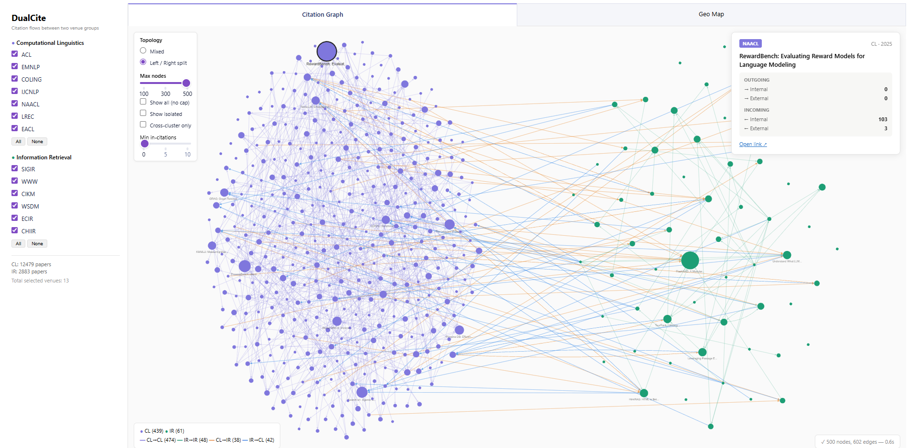
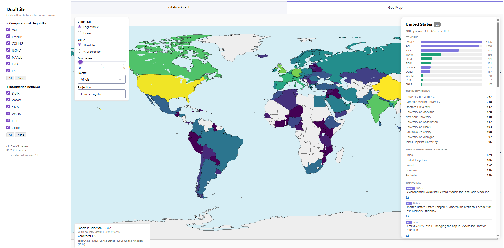

# DualCite

**Comparing research communities through cross-citation and affiliation analysis.**

DualCite compares two predefined groups of publication venues, for example the
conferences of two research fields. It extracts reference lists and author
affiliations directly from the papers' PDFs, links the citations between the
papers of the two groups, measures how much each group cites the other, and
shows the result in two linked interactive views: a citation graph and a world
map of author affiliations. Everything that describes a particular pair of
groups is kept in a configuration file, so the tool is not tied to one pair of
fields.

The repository also contains the dataset of the case study described in the
accompanying master's thesis: 15,362 papers published in 2025 at Computational
Linguistics (CL) and Information Retrieval (IR) conferences. The dataset is
separate from the tool; it serves as a working example and makes the thesis
results reproducible.

### Citation Graph
Papers are nodes and citations are edges, coloured by direction (within a group
or across groups).



### Geo Map
A world map of the authors' countries, with details for each country.



---

## Contents of the repository

| Path | Content |
|---|---|
| `dualcite/` | The tool: index building, the web application with both views, the GROBID runner |
| `export_summary.py` | Writes a Markdown report with all measurements |
| `config.yaml` | Configuration of the case study: all 13 CL and IR venues |
| `config_acl_sigir.yaml` | Second configuration: only the main ACL and SIGIR conferences |
| `data/` | Case-study data: paper lists and GROBID XML (no PDFs) |
| `reference-lists/` | Historical publication lists for the reference-list measurement (compressed) |
| `validation/` | Manually labeled validation samples and the scripts that draw and score them |
| `examples/` | Results of the case study and screenshots |
| `data-collection/` | Research scripts that built the case-study dataset; not part of the tool |
| `pdfs/` | Empty folders for your own PDFs |

## Installation

Python 3.10 or newer is required (the case study used Python 3.13).

```bash
git clone https://github.com/Silence1337/dualcite.git
cd dualcite
pip install -r requirements.txt
```

## Quickstart: explore the case-study data

The repository contains everything needed to open the views; GROBID and PDFs are
not required. There are two configurations:

```bash
# all 13 configured venues: 12,479 CL papers and 2,883 IR papers
python -m dualcite.app

# only the main ACL conference (1,966 papers) and the main SIGIR conference (540 papers)
python -m dualcite.app --config config_acl_sigir.yaml
```

The application opens at http://127.0.0.1:8050. The repository includes the
prebuilt index of both configurations and the layouts of the most common graph
views (`data/.precomputed*`), so the application starts in seconds. The index is
rebuilt automatically when the code, the configuration, or the data change;
building it from scratch takes a while, because every cited title is compared
with all titles of the dataset. A graph view that has not been opened before is
laid out once and then cached. Views with many thousands of nodes (all venues,
*Show all*, *Show isolated*) remain slow to draw in the browser even when their
layout is cached, which is what the *Max nodes* limit is for.

## The two views

The sidebar selects the venues of each group, and the selection applies to both
views.

**Citation Graph.** Each paper is a node, coloured by group. A node's size shows
how often the paper is cited within the displayed graph, scaled separately in
each group, so that the most-cited papers of both groups appear at a similar size
although the groups differ strongly in size. Edges are coloured by direction:
within CL, within IR, CL citing IR, and IR citing CL. Controls:

- **Topology:** *Mixed* uses a force-directed layout of the whole graph; *Left /
  right split* places the two groups on opposite sides, which shows the flow
  between them rather than the structure inside each group.
- **Max nodes** (100 to 500) keeps the most connected papers of each group,
  with incoming citations weighted twice as much as outgoing ones, and divides
  the places between the groups in proportion to their size; *Show all*
  removes the limit.
- **Min in-citations** keeps only the papers cited at least N times within the
  displayed links, and the links between them.
- **Cross-cluster only** shows only the citations between the groups; combined
  with *Min in-citations*, a paper must be cited at least N times by the other
  group.
- **Show isolated** also shows papers that have no links in the displayed
  graph; with *Min in-citations*, these are the papers that pass the filter but
  are not linked to another such paper. Links between two much-cited papers of
  different groups are rare, so with *Cross-cluster only* and *Min
  in-citations* turn on *Show isolated* to see the papers that pass the filter.

Clicking a node opens a panel with the paper's venue and title and its incoming
and outgoing citations in the whole dataset, split by group.

**Geo Map.** Countries are coloured by the number of papers with at least one
author there (full counting), on a logarithmic or linear scale, as absolute
numbers or as a share of the selection. Clicking a country shows its papers by
venue, its most frequent institutions, the countries it co-authors with most
often, and its most-cited papers.

## How DualCite works

1. **Extraction.** GROBID converts each PDF into TEI XML twice: once for the
   reference list, once for the header with authors and affiliations.
2. **Venues.** Each paper is assigned to a venue from its metadata, using
   substring patterns from the configuration. Records that are not papers, such
   as proceedings front matter, can be excluded by configurable rules.
3. **Citation matching.** Each reference is resolved to a paper of the dataset
   by DOI, by exact normalized title, or by fuzzy title matching (RapidFuzz,
   score of at least 90 of 100 by default). A title match is rejected when the
   year given in the reference is more than one year older than the matched
   paper, which removes older papers whose titles resemble those of newer ones.
4. **Three measurements of the citation flow:**
   - *in-corpus links:* citations between papers of the dataset;
   - *venue names:* references whose cited venue name matches a configured venue;
   - *reference lists:* references matched against historical publication lists of
     both communities, covering all years.
5. **Affiliations.** Countries are read from GROBID's country codes and country
   names, from city and address fields, or inferred from institution names.
   Institutions are normalized and paired with the countries of their own
   affiliation.
6. **Views and report.** The results are cached in an index that feeds the two
   views and the summary report.

## Reproducing the results of the thesis

```bash
# main configuration: all venues
python export_summary.py --cl-refs reference-lists/acl_all_papers_full.json \
                         --ir-refs reference-lists/ir_all_years_works.json

# second configuration: main ACL and SIGIR conferences
python export_summary.py --config config_acl_sigir.yaml --out results_acl_sigir.md \
                         --cl-refs reference-lists/acl_main_all_years.json \
                         --ir-refs reference-lists/sigir_main_all_years.json

# precision of citation matching and accuracy of affiliation processing
python validation/score.py
```

The reference lists are stored as `.json.gz`; `export_summary.py` reads the
compressed file automatically. The outputs should match
`examples/results_summary.md`, `examples/results_acl_sigir.md`, and
`validation/validation_results.md`.

The report contains the corpus overview, the citation flow between the groups,
the venue-name and reference-list measurements, statistics for each venue, the
leading countries and institutions under full and fractional counting,
co-authorship pairs of countries, the most-cited papers, and the citation flow
recomputed under different matching rules.

## Validation

The accuracy of the tool was measured on manually labeled, stratified random
samples (`validation/`):

- `citation_sample.csv`: 210 candidate citation links, stratified by match type
  (DOI, exact title, four bands of the fuzzy score, links rejected by the year
  check), each labeled as the same work or not;
- `affiliation_sample.csv`: 100 papers, stratified by how their countries were
  identified, with the countries and institutions checked against the first
  page of the paper.

`score.py` computes the results from these labels (`validation_results.md`).
With the default settings, an estimated 99.1% of the accepted citation links are
correct, and the countries are correct for an estimated 92% of the papers with
an identified country. `make_samples.py` draws new samples for another dataset;
it does not overwrite files that already contain labels.

## Using your own venues

1. **Paper lists.** Create two JSON files, one per group, for example
   `data/papers/cluster_a.json` and `data/papers/cluster_b.json`. Each is a list
   of records; the field names are mapped in the configuration:

   ```json
   [
     {"anthology_id": "2025.acl-long.1", "venue": "acl",
      "title": "Some Paper", "doi": "10.18653/v1/2025.acl-long.1"}
   ]
   ```

2. **PDFs.** Put the PDFs of each group into `pdfs/a` and `pdfs/b`. The file
   names must match the paper ids: the id itself if the list has an id field
   (for example `2025.acl-long.1.pdf`), otherwise
   `{sanitized_title}__{doi_suffix}.pdf`. The scripts in `data-collection/`
   show how the case-study PDFs were obtained.

3. **GROBID.** Start a GROBID server (the case study used version 0.8.2 with its
   CRF models) and process each group:

   ```bash
   docker run --rm -p 8070:8070 grobid/grobid:0.8.2-crf

   python -m dualcite.grobid_runner ./pdfs/a --cluster a --config config.yaml
   python -m dualcite.grobid_runner ./pdfs/b --cluster b --config config.yaml
   ```

   The XML is written to `data/refs_xml/{a,b}/` and `data/headers_xml/{a,b}/`.
   The runner skips files that are already processed, so it can be restarted,
   and it lists the files that failed.

4. **Configuration.** Adapt `config.yaml` (see below) and start the
   application with `python -m dualcite.app --config config.yaml`.

## Configuration

| Section | Content |
|---|---|
| `clusters` | For groups `a` and `b`: name, short name, colour, list of venues |
| `edge_colors` | Colours of the four citation directions |
| `venue_patterns` | Substrings that identify each venue in metadata and in cited venue names; the first match wins, so specific patterns go first |
| `data` | Paths of the paper lists, the XML folders, and the index cache |
| `schema` | Which fields of the paper lists hold the id, venue, title, and DOI; `venue_from` names a fallback field with the proceedings title |
| `matching` | `fuzzy_threshold` (90), `min_words_for_fuzzy` (4), `fuzzy_candidate_floor` (80; lower-scoring candidates are only logged for the sensitivity analysis), `max_year_gap` (1) |
| `exclude_source_patterns` | Records whose venue or proceedings field contains one of these strings are skipped (for example a newsletter) |
| `exclude_title_prefixes`, `exclude_id_suffixes` | Records that describe a whole volume rather than a paper |
| `include_id_prefixes` | Optional: keep only papers whose id starts with one of these prefixes (used for the main ACL tracks) |
| `server` | Port and whether to open the browser |

`config_acl_sigir.yaml` shows how a second analysis is set up without changing
any code: other venue lists, two filters, and a separate index cache.

## The case-study dataset

| Group | Venues (2025) | Papers |
|---|---|---:|
| CL | ACL, EMNLP, NAACL, COLING, IJCNLP (all event volumes, including Findings and workshops); LREC and EACL held no 2025 edition | 12,479 |
| IR | WWW (main and companion), CIKM, SIGIR (with SIGIR-AP and ICTIR), ECIR, WSDM, CHIIR | 2,883 |

- `data/papers/`: the two paper lists (ACL Anthology metadata, CC BY 4.0;
  IR metadata from dblp, CC0, and Crossref);
- `data/refs_xml/`: the reference lists extracted by GROBID;
- `data/headers_xml/`: the headers extracted by GROBID, with the abstracts
  removed;
- `reference-lists/`: historical publication lists (see its README).

The PDFs are not included. How the data was collected is described in
`data-collection/README.md`.

## Limitations

- The case study covers a single year, and each research community is
  represented by a selected group of venues.
- Precision was measured on labeled samples, but recall was not.
- About 10% of the papers have no identified country, and institution names are
  less reliable than countries (70% to 80% correct in the validation).
- The dictionary that infers countries from institution names was extended using
  this dataset, so it covers other data less well.

## Citation and license

The code is released under the MIT license (`LICENSE`). If you use DualCite,
please cite it as described in `CITATION.cff`.
